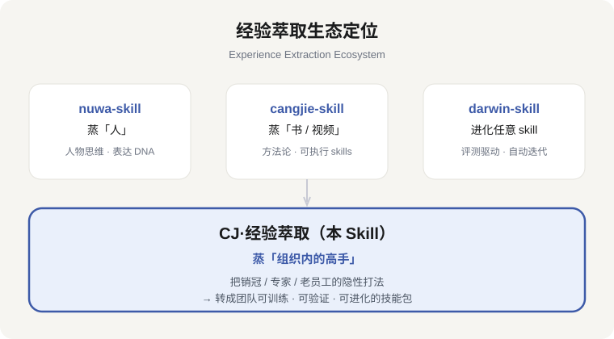

# CJ·经验萃取（Experience Extraction）v4.2

> 把「人会做但说不清」的高手经验，变成「看得见、学得会、用得着、验证过」的组织资产或个人方法论。

**一句话定位**：nuwa 蒸「人」、cangjie 蒸「书/视频」、darwin 进化 skill——**CJ 蒸「组织内的高手」，把销冠/专家/老员工的隐性打法，转成团队可训练、可验证、可进化的技能包**。



---

## 这是什么

CJ·经验萃取是一个 **Agent Skill**（基于 Agent Skills 规范构建），通过**对话式动态萃取**完成经验提炼：

- **对话式追问**：每轮听完回答，给出 2~5 个编号追问方向菜单，由被萃取者自选深挖——问得越多，挖得越深。
- **五层状态机**：基操 → 方法 → 牛招 → 心法 → 边界，识别「只有他会」的牛招，判停收敛。
- **三重验证门禁**：每条打法过 V1 跨域复现 / V2 预测力 / V3 独特性，不过就降级淘汰。
- **落地验证协议**：A/B 对照、SOP 可用性测试（新人照着做能否 60 分）、冲突仲裁、经验过期检测。
- **产出即落地**：组织级萃取直接产出「可安装团队技能包」（打法库 + 成果物 + 训练包 + 验证包 + DIGEST）。

**适用场景**
- 个人经验萃取：萃取某个人（专家/销冠/老员工/自己）在特定领域的成功打法 → 个人方法论/经验手册。
- 组织级经验复制：锁定关键业务场景（新客开发、大客户攻坚等），从多位高手批量萃取 → 标准动作库/培训课程/团队技能包。

**不适用**：泛泛的经验建议咨询、无具体高手的纯知识问答、名人角色扮演（那是 nuwa 的范畴）。

---

## 快速开始

在你的 Agent 环境中启用本 skill 后，直接说：

```
帮我萃一下我们销冠的成功经验          → 组织模式
想把老王做单子那套方法整理出来        → 个人模式
团队新人上手太慢，怎么办              → 模糊需求 → 场景诊断
```

收到需求后，skill 会按 **Quick Start** 推进：

1. **定**：入口分流 → 定场景/人/对象/局 + 档位（快速/标准/深度）
2. **萃**：五层状态机 + 追问菜单，动态深挖直到区分出基操与牛招
3. **验 + 用**：三重验证门禁 → 按「三问选择器」封装成果 → 组织级产出团队技能包

完整流程见 `SKILL.md`，详细方法论在 `references/`。

---

## 目录结构

```
cj-jingyan-cuiqu/
├── SKILL.md                    # 主文档：入口分流 + 主流程 + 质量红线（v4.0）
├── README.md                   # 中文使用说明（本文件）
├── README.en.md                # English README
├── LICENSE                     # MIT License
├── CHANGELOG.md                # 版本变更记录
├── TESTING.md                  # 发布前四层自测清单
├── references/                 # 按需加载的方法论（渐进式披露 L3）
│   ├── entry-routing.md        # 入口分流/档位/检查点/断点续跑
│   ├── extraction-state-machine.md  # 五层状态机 + 牛招判据
│   ├── question-tree.md        # 追问决策树（动态对话核心）
│   ├── verification-gates.md   # 三重验证门禁 + 落地验证协议
│   ├── skill-pack-template.md  # 可安装团队技能包
│   ├── trigger-evals.md        # 触发评测 + 产出质量评测 + Voice Check
│   ├── fallback-matrix.md      # 失败降级表（对话式萃取异常预案）
│   ├── ecosystem-alignment.md  # 生态对齐（manifest/能力卡/darwin 评测）
│   └── …（共 14 个）
├── scripts/                    # 工程工具
│   ├── validate_skill_pack.py  # 技能包结构校验（含 JSON Schema）
│   ├── generate_index.py       # 打法库索引自动生成
│   ├── run_evals.py            # 触发评测运行器（P1）
│   └── test_validate_schema.py # Schema 校验回归测试
├── schemas/
│   └── skill-pack.schema.json  # skill-pack.yaml 的 JSON Schema
├── tests/
│   ├── eval_set.json           # 触发评测语料（10 例）
│   └── EVAL_BASELINE.md        # 评测基线（改版后回归用）
├── examples/
│   └── demo-新客开发-销冠技能包/ # 完整案例（销冠经验 → 团队技能包）
├── assets/                     # 生态定位图（README 用）
└── archive/                    # 历史版本归档（v1.0 ~ v4.0）
```

---

## 验证

交付前必须过质量评测（质量红线第 7 条）：

```bash
# 1. 技能包结构校验
python scripts/validate_skill_pack.py <技能包目录>

# 2. 打法索引自动生成
python scripts/generate_index.py <技能包目录>

# 3. 触发评测语料校验 + 基线回归
python scripts/run_evals.py --check
python scripts/run_evals.py --report
python scripts/run_evals.py --grade <actual_results.json>

# 4. Schema 回归测试
python scripts/test_validate_schema.py
```

---

## 版本历史

| 版本 | 主题 | 说明 |
| --- | --- | --- |
| v4.2 | 真实萃取演练+双demo | 社群从0→1增长打法包（3牛招卡）、自测报告更新 |
| v4.1 | 发布前自测 | TESTING.md 四层自测清单（基线/演练/Voice/盲测） |
| v4.0 | 开源传播 | LICENSE、双语 README、生态定位图、benchmark 演示、发布指南 |
| v3.3 | 对标优化 | SKILL.md↔references 去重（消 smell）、工程工具时机表、口语触发 |
| v3.2 | 术语统一 | "干法"→"打法"全量替换（含路径/脚本） |
| v3.1 | 工程补全（P1） | 评测语料固化 + run_evals.py 基线回归、根目录 README、frontmatter 版本号联动 |
| v3.0 | 结构增强 | description 第三人称 + 防呆、Quick Start、何时不使用、防提示注入红线、内嵌迷你示例 |
| v2.2 | 制作质量 | 萃取师 Voice Check、失败降级表、JSON Schema 校验、打法索引生成、回炉上限、知情同意 |
| v2.1 | 生态评测 | 触发评测协议、生态对齐规范、技能包校验脚本、完整案例 demo |
| v2.0 | 工程化 | 入口分流/档位、五层状态机、三重验证、可安装技能包；命名 CJ·经验萃取 |
| v1.0 | 基础版 | 原始经验萃取方法论 |

完整变更见 `CHANGELOG.md`；每版均完整归档于 `archive/`。

---

## 生态与致谢

- **方法论参考**：AACTP「经验萃取」全景案例大会（叶敬秋 / 刘永中 / 陈晓燕 / 曾子亮 / 褚冬彪 / 周珊），国际国内专业经验萃取方法论。
- **工程对标**：Anthropic Agent Skills 官方工程指南、cangjie-skill（仓颉·蒸书）、nuwa-skill（女娲·蒸人）、darwin-skill（进化）。
- **对齐规范**：Agent Skills frontmatter、darwin 评测用例格式、可安装技能包 manifest。

## 对外发布与贡献

**发布到 GitHub 前请完成**：① LICENSE（已提供，MIT）② 英文 README（已提供 README.en.md）③ GitHub Topics（skill、agent-skills、claude、knowledge-distillation、experience-extraction）④ benchmark 全绿（见「验证」）⑤ demo 技能包可跑。

**贡献流程**：clone → 跑 `run_evals.py --check`（基线必须 PASS）→ 修改 → 补/更新评测语料 → `--grade` 全绿 → PR。改动不得删减 references 方法论；术语、目录、脚本改动请同步更新 README / CHANGELOG / version 字段。

## 作者与版权

**作者**：Jie Cai / 斯泷 — 青影纪元科技创始人 · 青影星球AI 社群发起人 · AI 产品经理 / AI 培训讲师。

© 2026 Jie Cai / 斯泷. 本 Skill 以 MIT 许可证开源，欢迎自由使用、修改与二次分发（请保留版权与作者署名）。

- 公众号：青影星球AI
- Built with 豆包工作（Doubao Work）
